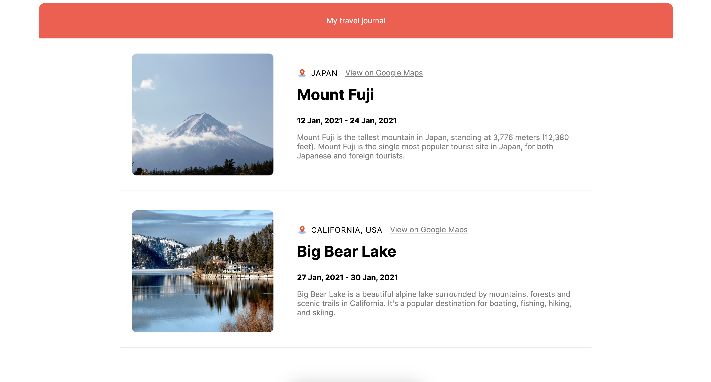

# My Travel Journal

A React application that displays a list of travel destinations, including location, start and end dates, description, and an image.

## Table of Contents

- [Screenshot](#screenshot)
- [Components](#components)
  - [App.js](#app)
  - [Nav.js](#nav)
  - [Container.js](#container)
- [Assets](#assets)
  - [Data](#data)

## Screenshot

## Components

This project consists of 3 components:

### App

This is the main component which maps through the data to display all the travel destinations. It includes a Nav component to display a navigation bar and displays each Container component with its data.

### Nav

This component displays the navigation bar with the text "My Travel Journal".

### Container

This component takes the data from the props and displays each travel destination's location, start and end dates, description, and an image.

## Assets

This project uses 2 assets:

### Data

This project uses a static data file travelData which contains an array of objects representing different travel destinations. Each object has the following properties:

- title: the name of the destination
- location: the location of the destination
- googleMapsUrl: a link to view the destination on Google Maps
- startDate: the starting date of the trip
- endDate: the end date of the trip
- description: a brief description of the destination
- imageUrl: a URL to an image of the destination
